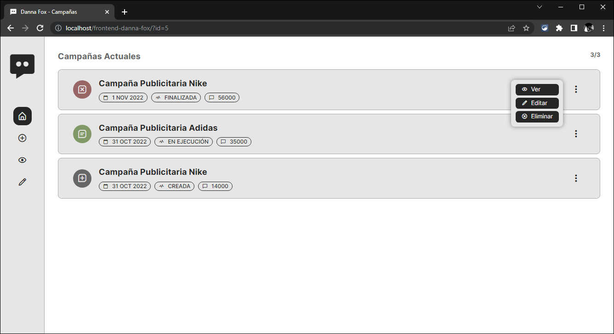

# Frontend Danna Fox

## Tabla de Contenidos

---

1. [Información General](#informacion-general)
2. [Tecnologías](#tecnologías)
3. [Instalación](#Instalación)

### Información General

---

Este es un frontend realizado para la materia Laboratorio de Lenguajes, en la cual nos propusieron la resolución a nivel grupal de un proyecto de software web.

Por consiguiente, este repositorio contará con la parte de diseño, maquetado y funcionalidad del proyecto. Este deberá conectarse a la base de datos desarrollada por los demás integrantes del grupo encargados de esa área.

### Screenshot Aplicación



## Tecnologías

---

Lista de tecnologías utilizadas en el proyecto:

- [PHP](https://www.php.net/): Versión 8.1
- [Composer](https://getcomposer.org/): Versión 2.4.4
- [Doctrine](https://www.doctrine-project.org/): Versión 2.13.3

## Instalación

---

Para instalar el proyecto deberá de contar con algún programa que facilite el crear un servidor web local como XAMPP, WAMP, o cualquier otro gestor que te lo permita. Además de esto, deberá contar con la versión 2.4.4 o superior de Composer en su computadora.

Seguido de esto clonar el repositorio en la carpeta htdocs en caso de utilizar XAMPP o en caso de utilizar otro software en su carpeta respectiva.

```
$ cd ../ruta/a/htdocs
$ git clone https://github.com/gino-canestrari/frontend-danna-fox.git
```

Luego deberá ejecutar el siguiente comando dentro del directorio del proyecto, esto hará que se instalen las dependencias necesarias para que todo funcione correctamente.

```
$ composer update
```

Posteriormente, deberá configurar las variables de entorno del proyecto, para esto tiene que crear un archivo con el nombre «.env» y dentro de este colocar las variables correspondientes a la base de datos creada en MySQL. Un ejemplo de configuración se encuentra en el archivo «.env.example» el cual contiene lo siguiente.

```
ENTITY_DIR="./src/models"

DATABASE_PORT=3306
DATABASE_NAME="dannafox-example"
DATABASE_HOST="localhost"
DATABASE_DRVR="pdo_mysql"
DATABASE_CHAR="UTF8"
DATABASE_USER="root"
DATABASE_PASS=""
```

Ya con las variables configuradas deberá generar la base de datos, en caso de ya contar con la misma creada simplemente podrá usar la aplicación correctamente, en caso contrario podrá generarla con Doctrine o manualmente utilizando el archivo «database.sql» que se encuentra en la raíz del proyecto.

En caso de querer hacerlo con Doctrine pude utilizar el comando brindado para este fin, el cual permite generar la base de datos a partir de los modelos de entidades.

```
$ ./bin/doctrine orm:schema-tool:update --force
```

Finalmente y asumiendo que ya tiene el servidor Apache y MySQL encendido podrá acceder a la aplicación ingresando al siguiente enlace.

- http://localhost/frontend-danna-fox/
