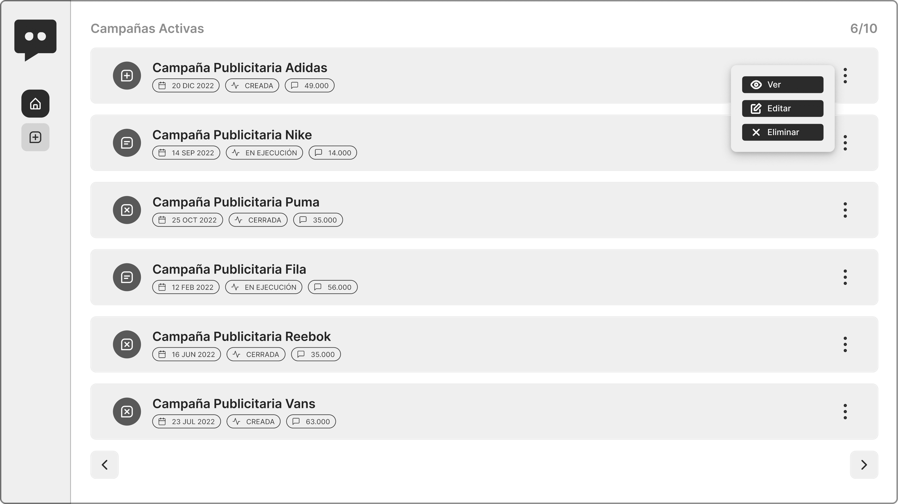

# Frontend Danna Fox

## Tabla de Contenidos

1. [Información General](#informacion-general)
2. [Tecnologías](#tecnologías)
3. [Instalación](#Instalación)

### Informacion General

---

Este es un frontend realizado para la materia Laboratorio de Lenguajes, en la cual nos propusieron la resolucion a nivel grupal de un proyecto de software web.

Por consiguiente, este repositorio contara con la parte de diseño, maquetado y funcionalidad del proyecto. Este debera conectarse con la base de datos desarrollada por los demas integrantes del grupo encargados de esa área.

### Captura



## Tecnologías

---

Lista de tecnologias utilizadas en el proyecto:

- [PHP](https://www.php.net/): Versión 8.1

## Instalación

---

Para instalar el proyecto debera de contar con algun programa que facilite el crear un servidor web local como XAMPP, WAMP, o cualquier otro gestor que te lo permita.

Posteriormente clonar el repositorio en la carpeta htdocs en caso de utilizar XAMPP o en caso de utilizar otro software en su carpeta respectiva.

```
$ cd ../ruta/a/htdocs
$ git clone https://github.com/gino-canestrari/frontend-danna-fox.git
```

Luego si ya cuenta con el servidor encendido podra verlo accediendo a:

- http://localhost/frontend-danna-fox/
